## Hi there 👋 Welcome to My Profile!

 

---

### 🛡️ $\color{#00F0FF}{\textsf{Cybersecurity and Digital Forensics}}$

- 🕵️‍♂️ **$\color{#00FF9F}{\textsf{SOC Analyst | DFIR:}}$** Passionate about Security Operations, Incident Response, Threat Hunting, and Deep Digital Forensics.
- 🔬 **$\color{#00F0FF}{\textsf{Current Project:}}$** Developing an **All-in-One Memory Forensics Suite** powered by **Volatility 3** to streamline memory dump analysis, kernel artifact extraction, process injection detection, and malware investigation.
- 🛠️ **$\color{#BD93F9}{\textsf{Forensics and DFIR Toolset:}}$** Volatility 3, Autopsy, KAPE, Eric Zimmerman Tools, Wireshark, Splunk & Elastic SIEM.
- 🎨 **$\color{#FF79C6}{\textsf{Frontend as a Hobby:}}$** Love crafting clean, responsive web interfaces with pure **Vanilla CSS** without heavy frameworks.

---

## 💻 Languages:

  
  
  
  
  
  
  
  
  
  
  
  
  
  
  

 

## 🛠️ Technology & Tools:

  
  
  
  
  
  
  
  
  
  
  
  
  
  
  
  
  

---

## 📊 GitHub Stats:

  
  
   
  

